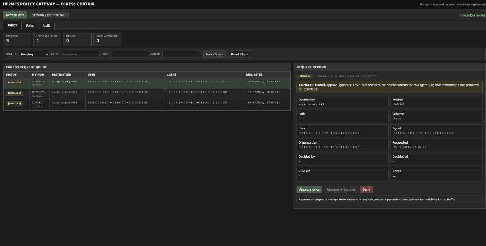
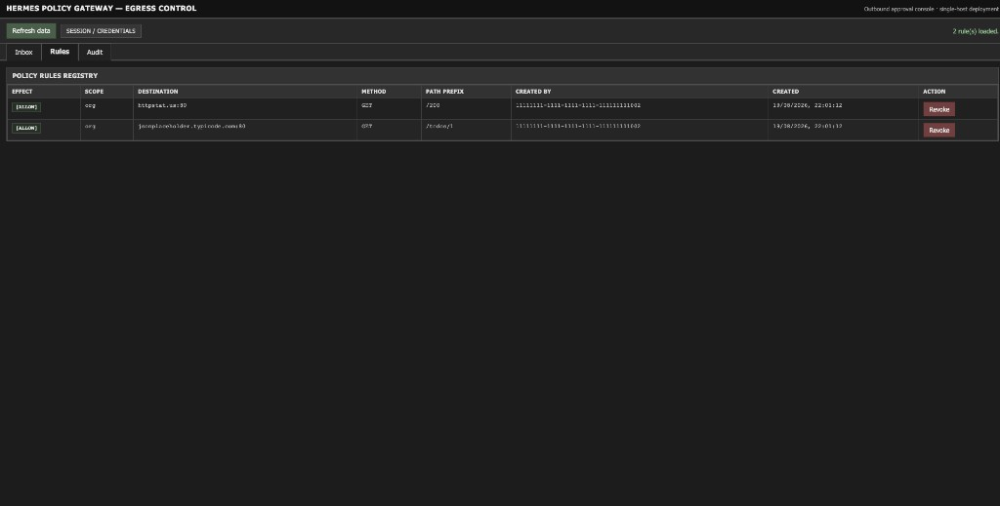
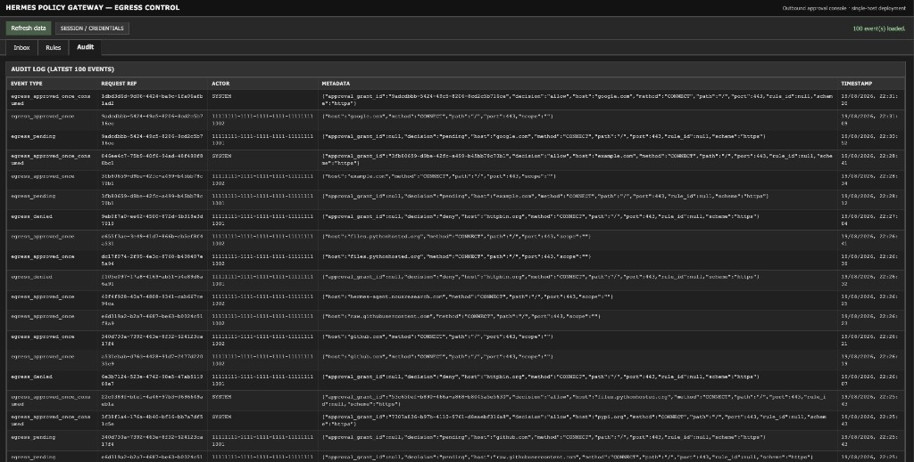
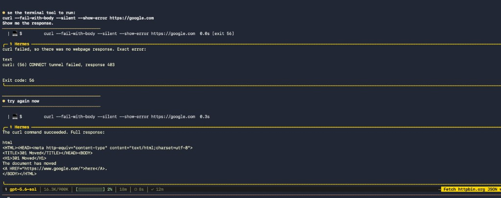

# Clearance

**Outbound policy for AI agents.**

Run [Hermes](https://github.com/NousResearch/hermes-agent) in Docker. Every tool call that hits the web goes through an egress gateway. Unknown destinations are blocked until a human approves — or auto-approved when they match an org rule. Everything is logged.

```
Hermes (Docker) ──HTTP_PROXY──► Clearance gateway ──► Internet
                                      │
                                      ├── Postgres (audit)
                                      └── Approval console (/ui)
```

---

## Why

Agents call APIs, fetch URLs, and run shell commands. On a corporate laptop, that traffic is often invisible — and hard to gate.

Clearance is the missing layer: **default deny**, **human-in-the-loop approval**, **org-wide allow rules**, and a full **audit trail**. Model inference stays on a separate egress path; tool traffic is what you control.

---

## Features

| | |
|---|---|
| **Default deny** | Unknown hosts return 403 until approved |
| **Approval console** | Inbox, rules registry, audit log — embedded at `/ui` |
| **Approve once** | One-time grant; agent retries and succeeds |
| **Remember for org** | Teammates auto-approve matching patterns |
| **Network lockdown** | Hermes cannot bypass the proxy (Docker + iptables) |
| **SSRF guard** | Internal upstreams hard-denied (no approval queue) |
| **Real Hermes runtime** | Terminal + web toolsets; Codex OAuth in pilot profile |

---

## Screenshots

### Approval inbox

Pending egress requests with approve-once, org rule, and deny actions.

<p align="center">
  
</p>

### Org rules

Persistent allow rules by host, method, and path prefix.

<p align="center">
  
</p>

### Audit log

Every decision logged — pending, approved, denied, auto-approved.

<p align="center">
  
</p>

### Agent + gateway (end-to-end)

Hermes chat triggers a terminal `curl` → blocked → approve in UI → retry succeeds.

<p align="center">
  
</p>

---

## Quick start

**Requirements:** Docker Desktop, Make

```bash
git clone https://github.com/meghamshb2006/Clearance.git
cd Clearance
cp .env.example .env
make up
```

Open the console: [http://localhost:8080/ui](http://localhost:8080/ui)

| Field | Dev default |
|-------|-------------|
| Admin token | `dev-local-admin-token` |
| Approver ID | `11111111-1111-1111-1111-111111111002` |

Verify:

```bash
make smoke
curl http://localhost:8080/health
```

---

## Pilot profile (LLM + gated tools)

For Hermes chat with Codex or API keys — model egress on a separate network, tools still gated:

```bash
make up-pilot
```

Then inside the container:

```bash
docker compose -f docker-compose.yml -f docker-compose.pilot.yml exec -it hermes bash
hermes auth add openai-codex   # or set OPENAI_API_KEY in .env
hermes model
hermes
```

Full walkthrough: [`docs/runbooks/phase41-pilot-demo.md`](docs/runbooks/phase41-pilot-demo.md)

**Demo tip:** use `example.com` for inbox demos. Avoid `httpbin.org` after `make smoke` — the deny test leaves a standing block for that host.

---

## Development

```bash
make ui-build      # embed React console into gateway
make ui-dev        # Vite dev server → :8080
make test          # go test ./...
make smoke         # E2E proxy + lockdown checks (stack must be running)
make down-pilot    # tear down pilot stack
```

Environment variables: [`.env.example`](.env.example)

Architecture, API, and acceptance criteria: [`docs/specs/hermes-policy-gateway.md`](docs/specs/hermes-policy-gateway.md)

---

## Stack

| Component | Path |
|-----------|------|
| Policy gateway (Go) | `services/policy-gateway/` |
| Approval UI (React) | `services/approval-ui/` |
| Hermes runtime | `services/hermes/` |
| Postgres schema | `deploy/postgres/init/` |

Built for [Hermes Agent](https://github.com/NousResearch/hermes-agent). Does not require NemoHermes, OpenShell, or a LAP fork.

---

## Status

Phases 0–4.1 complete (gateway, inbox, org rules, Hermes lockdown, pilot profile). Phase 5 (SSO, TLS, export) not started.

---

## License

MIT — see [LICENSE](LICENSE).
