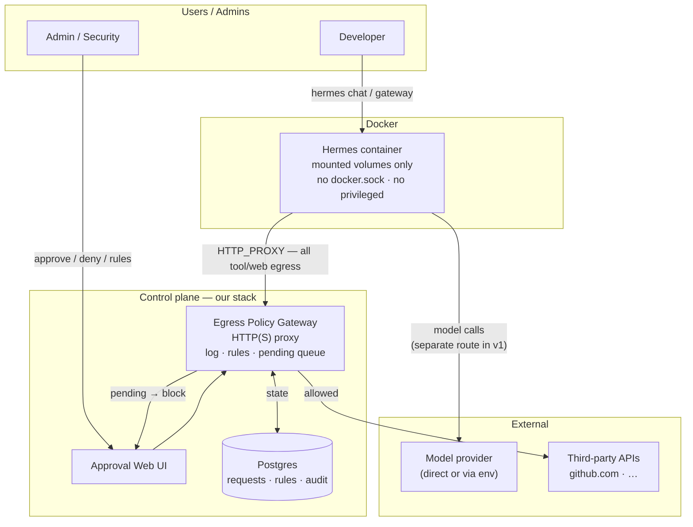
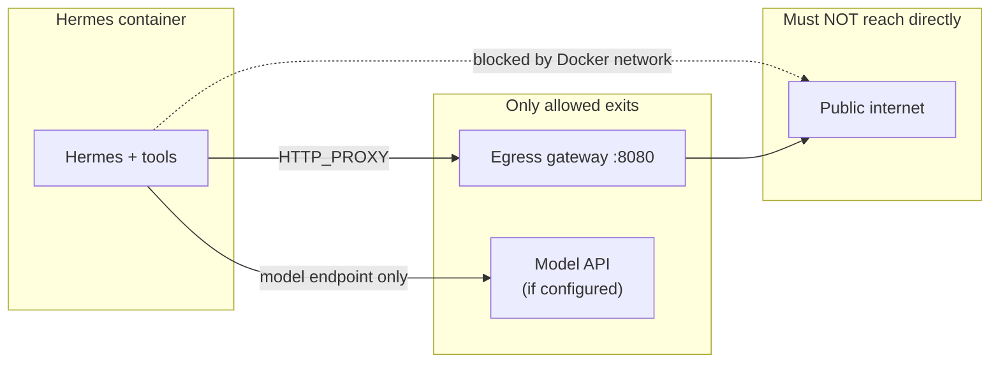
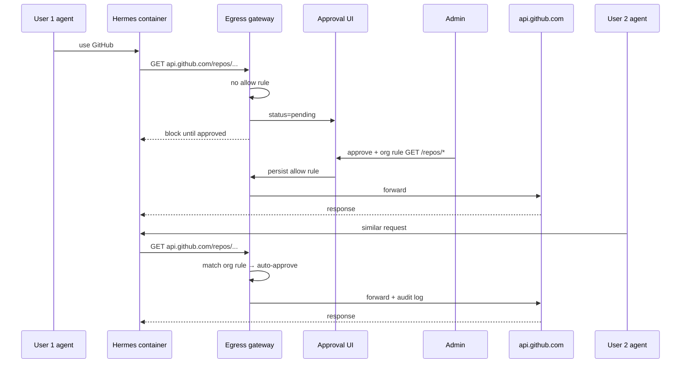
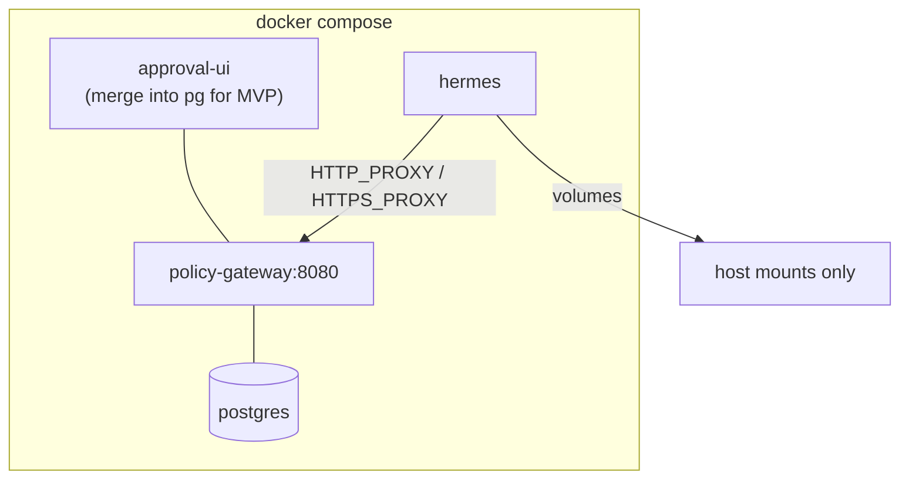

# Hermes Policy Gateway — Agent Handoff Document

> **For coding agents:** Read this entire file before writing code, suggesting architecture changes, or installing third-party platforms. This is the source of truth for a **new product** that lives alongside (not inside) the Portfolio Website Next.js app.

---

## How to use this document

| Section | When to read |
|---------|----------------|
| [Executive summary](#executive-summary) | First — 60-second orientation |
| [Origin & context](#origin--context-why-this-exists) | Before proposing solutions — avoids repeating failed paths |
| [Strategic decisions (locked)](#strategic-decisions-locked) | Before choosing LAP fork, OpenShell, NemoHermes, etc. |
| [Common agent mistakes](#common-agent-mistakes-do-not-do-these) | Before implementing |
| [Architecture](#architecture-v1) | When designing services |
| [Policy & data model](#policy-model) | When building gateway + DB |
| [MVP & acceptance criteria](#mvp-phases--acceptance-criteria) | When scoping work |
| [References](#external-references) | When integrating Hermes or borrowing patterns |

**Conflict resolution:** If the user’s latest message conflicts with **Strategic decisions** or **Non-goals**, follow this file and ask for clarification.

**Repo note:** Spec currently lives at `docs/specs/hermes-policy-gateway.md` in the Portfolio Website repo. Implementation should eventually move to its **own repo** or `services/policy-gateway/` — nothing is built yet.

---

## Executive summary

**Product:** A deployable **egress policy gateway** + **approval web UI** so Hermes agents running in Docker cannot reach the internet without logging, human approval, and optional shared org allow rules.

**One sentence:** Run Hermes in Docker with only mounted files visible; force all outbound HTTP(S) through our gateway; admins approve/deny in a UI; User 2 reuses User 1’s approved host/path patterns at org scope.

**Wedge:** **Monitorability** — corporate teams cannot trust agents on laptops because they cannot see or gate network calls. NemoHermes/OpenShell solve this with heavy infra. LiteLLM Agent Control Plane (LAP) solves agent orchestration but **not per-request HTTP egress**. We build the missing egress layer.

**v1 decision:** Build our gateway first. **Do not fork LAP.** Reference LAP’s Hermes Docker template and inbox UX only.

**Implementation status:** **Spec only.** No services, no code scaffold, no running stack.

---

## Origin & context (why this exists)

### What the user was trying to solve

The user explored running **Hermes** (Nous Research agent) on a Mac for personal/corp use. Pain points discovered in prior sessions:

1. **NemoHermes + OpenShell** works but is **too complex** to deploy (gateway recover, onboard, `inference.local`, sandbox recreate wipes OAuth, etc.).
2. **Monitorability** is the core gap: when an agent calls `api.github.com`, there is no simple inbox where a human approves it and a second user benefits from that approval.
3. **Corporate risk:** running agents directly on a laptop with full filesystem and network access is unacceptable; Docker + controlled mounts + gated egress is the desired shape.
4. **ChatGPT Plus / Codex OAuth** is a Hermes-native auth path (`hermes auth add openai-codex`) — **not** the same as OpenShell “default inference provider” or `nemohermes inference set`. That distinction caused confusion; this project does not require solving Codex OAuth in v1, but Hermes-in-Docker must remain compatible with it later.
5. **Ollama / qwen** was used as local inference via NemoHermes; user is moving away from that. This product is **not** about local LLMs — it’s about **network policy**.

### User intent evolution (chronological)

| Phase | User asked for | Outcome / lesson |
|-------|----------------|------------------|
| 1 | Hermes via NemoHermes on Mac | Works but fragile after reboot; recover recreates sandbox |
| 2 | ChatGPT Plus / Codex as “default inference” | Codex OAuth lives **inside** Hermes sandbox; not an OpenShell `inference set` provider |
| 3 | Custom gateway like OpenShell approvals | Valid product idea — **egress gate + UI**, not OpenShell itself |
| 4 | Fleet control plane for many laptops | Broader vision; v1 is **single-host Compose**, fleet later |
| 5 | Use LAP as starting point | Compared; **don’t fork** — build egress layer, reference LAP patterns |
| 6 | Document for next agent | This file |

### What “success” looks like for the user

- `docker compose up` on a corp laptop → Hermes in container → agent tries external API → **request appears in web UI** → human approves → traffic flows → **audit log** exists.
- Second developer’s agent hits same API pattern → **auto-approved** via org rule, still logged.
- No OpenShell install, no `nemohermes onboard`, no kernel policy YAML.

---

## Strategic decisions (locked)

These are **not** open for reversal in v1 unless the user explicitly changes direction.

### 1. Build egress gateway first; do not fork LAP

**[LiteLLM Agent Control Plane](https://github.com/LiteLLM-Labs/litellm-agent-control-plane)** (~1.2k stars, Aug 2026) provides:

- Unified UI/API for multiple agent runtimes (including Hermes via `--profile hermes`)
- Postgres, sessions, LLM gateway, MCP proxy, **tool-level** approval inbox
- Hermes bridge template (`templates/hermes`) — Hermes behind “Claude Managed Agents” API; models route through LAP

**It does NOT provide:**

- Mandatory HTTP(S) egress proxy for all agent traffic
- Per-request approval by host/method/path
- Docker network lockdown so Hermes cannot bypass the proxy

**Decision:** Reference LAP; **do not fork**. Our code is the egress gateway.

**Decision rule:** Pitch = “gate every network call” → this product. Pitch = “full agent platform” → different product (revisit LAP then).

### 2. Do not use NemoHermes / OpenShell as the platform

User explicitly rejected deployment complexity. Copy the **product job** (egress visibility + human approval), not the software.

### 3. Hermes in Docker is required for this product

Hermes can run bare-metal; **this project requires containerization** for isolation story.

### 4. Two different “gateways” — never conflate

| Name | What it is | Our relationship |
|------|------------|------------------|
| **Hermes gateway** | Hermes chat/API (`hermes gateway run`) | Keep; we don’t replace it |
| **OpenShell gateway** | mTLS sandbox control plane | Out of scope |
| **LAP gateway** | LLM + MCP + platform API | Optional neighbor in v2 |
| **Egress policy gateway** | **Our product** — HTTP(S) proxy + approvals | Build this |

Pointing Hermes “gateway URL” at OpenShell or our proxy as if it were a chat server **will not work**.

### 5. Optional v2: LAP beside our stack

```text
Hermes → Egress Policy Gateway → internet (tools, web, APIs)   ← v1 core
Hermes → LAP /v1/messages       → models                      ← v2 optional
```

---

## Problem statement (detailed)

### Primary problem: agent monitorability

When an AI agent runs on a developer machine:

- Tooling and web fetch generate **opaque outbound HTTP(S)**.
- Security/compliance cannot **see** what left the machine.
- There is no **human-in-the-loop** gate before a new destination is contacted.
- There is no **durable allowlist** shared across users (“User 1 approved GitHub API for the org”).

### Secondary problem: deployability

Existing solutions that partially address isolation/policy:

| Solution | Monitorability | Deploy complexity | Fit for corp laptop |
|----------|----------------|-------------------|---------------------|
| NemoHermes + OpenShell | Strong (kernel policy) | Very high | Poor |
| LAP | Tool/MCP approvals only | Medium | Partial — no egress gate |
| Hermes alone | None | Low | Poor for corp |
| **Our egress gateway** | Strong (HTTP layer) | Low (Compose) | **Target fit** |

### Non-problem (out of scope for v1)

- Replacing OpenAI/Anthropic billing or Codex OAuth flows
- Building a new LLM router (LiteLLM already exists)
- Cloning robbyyeager.com portfolio site (different project in this repo)

---

## Goals

1. Hermes runs **only inside Docker** on the host.
2. Container sees **only explicitly mounted** directories (read-only by default where possible).
3. Container **cannot reach the public internet** except via **egress policy gateway** (proxy env + Docker network enforcement).
4. Gateway **logs every outbound HTTP(S) request** with: method, host, path, agent_id, user_id, timestamp, decision, rule_id (if auto-approved).
5. **Web UI** lists pending requests; humans approve or deny.
6. On approve, optional **org-scoped allow rule** (host + method + path prefix) so other users/agents skip re-approval.
7. **Single `docker compose up`** deploys gateway + UI + DB + Hermes template.
8. **Audit trail** for compliance: who approved, when, what pattern was saved.

---

## Non-goals (v1 — do not implement)

### Platform / dependencies

- Do **not** fork or submodule **LiteLLM Agent Control Plane**.
- Do **not** depend on **NemoHermes, NemoClaw, or OpenShell**.
- Do **not** require `nemohermes onboard` or `openshell-gateway` on the host.

### Product scope

- Do **not** build a full multi-runtime agent platform (Slack, cron, fleet UI, A2A) in v1.
- Do **not** replace Hermes chat UI or `hermes gateway` protocol.
- Do **not** make the gateway an LLM or inference router (policy proxy only).

### Security scope

- Do **not** implement Landlock/seccomp/OPA (OpenShell-grade) in v1.
- Do **not** mount Docker socket into Hermes container.
- Do **not** run Hermes `--privileged`.
- Do **not** store secrets in allow rule keys (no query strings, no Authorization headers in rule patterns).

### Policy scope

- Do **not** auto-allow full URLs with embedded tokens as reusable rules.
- Do **not** silently allow unknown hosts in production mode (default deny pending approval).

### Repo scope

- Do **not** merge this into Portfolio Website `src/` unless user asks.

---

## Common agent mistakes (do not do these)

Agents helping the user previously went down wrong paths. **Avoid repeating:**

| Mistake | Why it’s wrong |
|---------|----------------|
| `nemohermes onboard --resume` to fix gateway | Resume only continues interrupted onboard; gateway restart is separate |
| `openshell gateway start` on OpenShell 0.0.85 | Subcommand may not exist; use `openshell-gateway` binary with toml |
| Point Hermes at `https://chatgpt.com` as API endpoint | Not OpenAI-compatible; 403 |
| `nemohermes inference set --provider openai-codex` | Codex OAuth is **Hermes-internal**, not OpenShell inference provider |
| Fork LAP and call it done | LAP lacks egress gate; fork doesn’t build core feature |
| Rely on `HTTP_PROXY` alone | Agent or libs can ignore; need **Docker network** restriction |
| Use NemoHermes recover in prod without expecting sandbox wipe | Recreate destroys in-sandbox OAuth (`/sandbox/.hermes/auth.json`) |
| Treat Plus subscription as API key | ChatGPT Plus ≠ OpenAI Platform API billing |
| Install Codex CLI on Mac as requirement | Hermes OAuth is in-container; Codex app optional |

---

## Glossary

| Term | Definition |
|------|------------|
| **Hermes** | [Nous Hermes Agent](https://github.com/NousResearch/hermes-agent) — CLI/agent runtime with tools, gateway, OAuth providers including `openai-codex`. |
| **Hermes gateway** | Hermes’s own HTTP API for chat/sessions (`hermes gateway run`). **Not our product.** |
| **Egress policy gateway** | **Our v1 product:** HTTP(S) forward proxy + policy engine + approval queue + audit API. |
| **Approval Web UI** | Human inbox for pending network requests + rule management + audit views. |
| **Allow rule** | Persistent policy: match host, port, method, path prefix → `allow` \| `deny` \| `require_approval`; scoped to `user` \| `org` \| `agent`. |
| **Pending request** | Outbound call blocked until human decision (or timeout → deny). |
| **Auto-approved** | Request matched an existing allow rule; still logged. |
| **CONNECT** | HTTP proxy method for HTTPS tunnels; v1 may approve at **host** level without MITM. |
| **MITM** | TLS interception for full URL visibility; harder; likely post-v1. |
| **LAP** | [LiteLLM Agent Control Plane](https://github.com/LiteLLM-Labs/litellm-agent-control-plane) — agent platform; **reference only** in v1. |
| **OpenShell** | NVIDIA sandbox/gateway — **out of scope**; inspiration for egress gating concept. |
| **NemoHermes** | NVIDIA CLI wrapping Hermes in OpenShell sandboxes — **out of scope** for this product’s runtime. |
| **inference.local** | OpenShell internal URL for model calls inside sandbox — irrelevant to our v1 gateway. |
| **openai-codex** | Hermes OAuth provider for ChatGPT Plus Codex; configured via `hermes auth add openai-codex` **inside** container. |

---

## Architecture (v1)

### High-level system diagram



### ASCII overview (for agents without Mermaid rendering)

```
Developer ──► Hermes (Docker) ──HTTP_PROXY──► Egress Gateway ──► Internet APIs
                    │                              │
                    │                              ├──► Postgres
                    │                              └──► Approval UI ◄── Admin
                    │
                    └──► Model API (separate route, v1 TBD)
```

### Network boundary (non-negotiable)



**Enforcement layers (both required):**

1. **Environment:** `HTTP_PROXY` / `HTTPS_PROXY` → gateway URL.
2. **Network:** Docker network ACL — Hermes container routes only to gateway (+ optional model endpoint). Direct egress to `0.0.0.0/0` must fail.

Proxy-only without network lockdown is **insufficient** (curl, custom clients, or misconfigured tools may bypass).

### Request flow — first user + org rule reuse



### Docker Compose topology (v1)



| Service | Image (TBD) | Ports | Responsibility |
|---------|-------------|-------|----------------|
| `policy-gateway` | build | 8080 | HTTP(S) proxy, policy eval, REST API |
| `approval-ui` | build or static | 3000 | Web inbox (may merge into gateway process for MVP) |
| `postgres` | postgres:16 | 5432 | Persistent state |
| `hermes` | build from Hermes Dockerfile | — | Agent runtime |

Suggested Docker network: `internal` network where only `policy-gateway` has external egress; `hermes` attached only to internal + gateway path.

---

## Component responsibilities

| Component | Owns | Does not own |
|-----------|------|----------------|
| **Egress policy gateway** | Proxy, log, evaluate rules, pending queue, forward/deny, REST API | LLM routing, chat UI, agent sessions |
| **Approval Web UI** | Pending inbox, approve/deny actions, rule CRUD, audit views | Tool-level approvals (unless added later) |
| **Hermes container** | Agent execution, tools, workspace, optional `hermes gateway` | Direct internet |
| **Postgres** | Requests, rules, actors, decisions, audit | — |
| **LAP (v2 optional)** | Multi-runtime platform, LLM keys, tool inbox | HTTP egress per request |

### Two approval layers (if LAP added later)

| Layer | Question | Owner |
|-------|----------|-------|
| Tool / MCP | “Should this tool run?” | LAP (optional, v2) |
| Network | “Should this HTTP call leave the host?” | **Our gateway (v1 core)** |

Do not assume LAP tool approvals substitute for network approvals.

---

## Comparison matrices

### Us vs LiteLLM Agent Control Plane

| Dimension | **Hermes Policy Gateway (us)** | **LAP** |
|-----------|-------------------------------|---------|
| Primary job | Egress monitorability + approval | Unified agent platform |
| Hermes support | Docker + forced proxy | `--profile hermes` bridge template |
| Approval unit | **HTTP request** (host/path) | Tool action + MCP allowlist |
| LLM routing | Out of scope v1 (optional separate path) | Built-in `/v1/messages` |
| Deploy | Compose: gateway + UI + DB + hermes | Compose: lap + postgres + optional profiles |
| Fork? | N/A — we build greenfield | **Do not fork for v1** |
| Repo | TBD new repo | github.com/LiteLLM-Labs/litellm-agent-control-plane |

**Borrow from LAP without forking:**

- [templates/hermes/Dockerfile](https://github.com/LiteLLM-Labs/litellm-agent-control-plane/tree/main/templates/hermes) — Hermes install pattern
- Inbox UX — `tool-approval-panel` concept for our network inbox
- Compose + Postgres patterns

### Us vs NemoHermes / OpenShell

| Dimension | **NemoHermes / OpenShell** | **Us** |
|-----------|---------------------------|--------|
| Isolation | Kernel policy (Landlock, seccomp, OPA) | Docker + mounts + network |
| Egress control | Policy YAML + supervisor | HTTP proxy + UI approvals |
| Inference | `inference.local` rewrite | Not required v1 |
| Onboard | `nemohermes onboard` | `docker compose up` |
| Recovery | Complex; may recreate sandbox | Restart containers |
| Codex OAuth | In sandbox; wiped on recreate | Same Hermes behavior if user uses Codex — document mount/backup separately |

### Us vs “point Hermes at custom gateway URL”

| Approach | Works? |
|----------|--------|
| Custom **OpenAI-compatible** URL for **models** | Yes — Hermes `model.base_url` |
| Custom URL as **Hermes gateway** (chat API) | Only if it implements Hermes/Anthropic managed agents protocol |
| OpenShell port as Hermes gateway | **No** — different protocol |
| Our egress proxy as **HTTP_PROXY** | **Yes** — this is the intended integration |

---

## Policy model

### Default stance

**Deny unless allowed or explicitly approved** (production mode).

Audit-only mode (log but allow) may exist for dev — not default for corp story.

### Evaluation order (first match wins)

1. **Deny rule** matches → block, log `denied`, stop.
2. **Allow rule** matches → forward, log `auto-approved`, attach `rule_id`.
3. No match → create **pending** record, block request, surface in UI.
4. Human **approve once** → forward this request only.
5. Human **approve + remember** → forward + create allow rule at chosen scope.
6. Human **deny** → block, log `denied`, optionally create deny rule.
7. **Timeout** (if configured) → deny pending requests.

### Rule shape (allowlist keys)

Rules match on:

- `host` (required) — e.g. `api.github.com`
- `port` (default 443/80)
- `method` — e.g. `GET`, `POST`, or `*`
- `path_prefix` — e.g. `/repos/` (no query string in rule)

Scope:

- `org` — any agent/user in org (User 2 reuse case)
- `user` — single user
- `agent` — single agent instance

**Never** persist query parameters or auth headers in rules.

### HTTPS in v1

| Approach | Visibility | Complexity | v1 recommendation |
|----------|------------|------------|-------------------|
| CONNECT + host allowlist | Hostname only | Low | **Start here** |
| Full MITM TLS | Full path + body | High | Post-v1 |

---

## Data model (sketch for implementers)

### Tables (logical)

**`actors`**

- `id`, `type` (`user` | `agent` | `admin`), `org_id`, `display_name`, `created_at`

**`agents`**

- `id`, `actor_id`, `container_id`, `name`, `last_seen_at`

**`egress_requests`**

- `id`, `agent_id`, `user_id`, `org_id`
- `method`, `host`, `port`, `path`, `scheme`
- `status` (`pending` | `approved` | `denied` | `auto_approved` | `expired`)
- `rule_id` (nullable — if auto-approved)
- `requested_at`, `decided_at`, `decided_by`
- `error_message` (nullable)

**`policy_rules`**

- `id`, `org_id`, `scope` (`org` | `user` | `agent`), `scope_ref_id`
- `effect` (`allow` | `deny`)
- `host`, `port`, `method`, `path_prefix`
- `created_at`, `created_by`, `expires_at` (nullable)

**`audit_events`**

- `id`, `egress_request_id`, `event_type`, `actor_id`, `metadata_json`, `created_at`

### IDs in proxy path

Gateway must know `agent_id` / `user_id` on each request. Options (pick one in implementation):

- Proxy URL embeds agent token: `http://gateway:8080/` with header `X-Agent-Id` / `Proxy-Authorization`
- Sidecar injects headers
- One Hermes container = one agent identity (simplest v1)

---

## API sketch (gateway + UI)

### Proxy (data plane)

- Listen `8080` (configurable)
- Standard HTTP proxy + HTTPS CONNECT
- On each request: evaluate policy → forward | block | hold pending

### Control plane (REST)

| Method | Path | Purpose |
|--------|------|---------|
| GET | `/api/v1/requests?status=pending` | List pending egress requests |
| GET | `/api/v1/requests/{id}` | Request detail |
| POST | `/api/v1/requests/{id}/approve` | Approve once or with `remember: true`, `scope: org` |
| POST | `/api/v1/requests/{id}/deny` | Deny with optional feedback |
| GET | `/api/v1/rules` | List policy rules |
| POST | `/api/v1/rules` | Create rule manually |
| DELETE | `/api/v1/rules/{id}` | Revoke rule |
| GET | `/api/v1/audit` | Audit log query |
| GET | `/health` | Health check |

Auth TBD: API key for admin UI, mTLS for corp — not blocking MVP on localhost.

---

## Hermes integration notes

### Running Hermes in Docker

Reference: [LAP templates/hermes](https://github.com/LiteLLM-Labs/litellm-agent-control-plane/tree/main/templates/hermes)

- Install Hermes from NousResearch/hermes-agent in image
- Per-session or single `HERMES_HOME`, `HERMES_WORKDIR`
- Toolsets like `terminal,web` generate outbound HTTP — **must** go through proxy

### Environment (conceptual)

```bash
HTTP_PROXY=http://policy-gateway:8080
HTTPS_PROXY=http://policy-gateway:8080
NO_PROXY=localhost,127.0.0.1,policy-gateway
# Optional: Hermes gateway port for developer access from host
```

### Volumes

```yaml
volumes:
  - ./allowed-project:/work:ro   # default read-only
  - hermes-data:/data            # Hermes state if needed
```

Do **not** mount `docker.sock`, entire `$HOME`, or `/`.

### Model / inference path (open — see recommendations)

Hermes needs LLM access. Options:

| Option | Pros | Cons |
|--------|------|------|
| A. Model traffic **also** through egress gateway | Single audit point | Must allow provider hosts; larger blast radius |
| B. **Separate** network path to model API only | Simpler policy split | Two egress paths to secure |
| C. v2: route models via LAP | Keys off agent | Adds LAP dependency |

**Recommendation for v1:** Option B — internal network allows Hermes → configured model endpoint(s) only; everything else → egress gateway. Document allowed hosts explicitly.

### Codex OAuth (future compatibility)

- Configured inside container: `hermes auth add openai-codex`
- Requires outbound HTTPS to `auth.openai.com`, `chatgpt.com`, `api.openai.com`
- Either pre-approve those hosts at org level or approve on first use
- Persist `/sandbox/.hermes/auth.json` via volume if sandbox recreate is avoided

---

## MVP phases & acceptance criteria

### Phase 0 — Scaffold

- [ ] New repo or `services/policy-gateway/` directory
- [ ] `docker compose` with postgres + gateway stub + hermes stub
- [ ] README pointing to this spec

### Phase 1 — Gateway core

- [ ] HTTP proxy accepts connections from Hermes container
- [ ] Every request persisted to Postgres with `pending` / `auto_approved` / `denied`
- [ ] Default deny unknown hosts (block with 403 or proxy error)

**Acceptance:** `curl -x http://gateway:8080 https://example.com` from Hermes container creates DB row.

### Phase 2 — Approval UI

- [ ] Web UI lists pending requests
- [ ] Approve once → request completes (or retry works)
- [ ] Deny → remains blocked

**Acceptance:** Human can approve a blocked GitHub API call from UI.

### Phase 2.5 — Team inbox UX

Purpose: evolve the MVP inbox into a **NemoHermes/OpenShell-style approval experience** without adopting their platform or deployment model.

- [ ] Replace the plain embedded HTML inbox with a richer inbox UI (React is acceptable)
- [ ] Keep the gateway as the source of truth; do **not** depend on NemoHermes, OpenShell, or LAP runtime APIs
- [ ] Inbox shows enough context for a human approver to decide safely: `user_id`, `agent_id`, method, host, port, path, scheme, requested time, current status
- [ ] Add request detail view or drawer for a single pending request
- [ ] Add filters at minimum for status, host, user, and agent
- [ ] Design the approve flow so Phase 3 can add `remember: true` and `scope: org` without reworking the UI
- [ ] Keep approve-once and deny as first-class actions in the inbox row/detail view
- [ ] Prepare the UI structure for future tabs/views: pending inbox, rules, audit

**Acceptance:** A reviewer can open the inbox, identify which user/agent triggered a request, inspect the request details, and approve or deny it without using raw API endpoints.

#### Phase 2.5 build context

This phase is about **UX and product shape**, not changing the core product decision.

- Copy the **approval inbox pattern** from NemoHermes/OpenShell/LAP if helpful
- Do **not** copy their control plane, onboarding flow, or sandbox runtime requirements
- The product remains a **single-host Compose deployment** in v1/v1.5
- The gateway remains an **HTTP(S) egress policy gateway**, not a Hermes chat server, not an LLM router, and not OpenShell

#### Phase 2.5 identity assumptions

The richer inbox is only useful if each request can be attributed clearly.

- One Hermes container = one `agent_id` remains acceptable in v1
- The data model already includes `actors`, `agents`, `user_id`, `agent_id`, and `org_id`; the UI should expose them instead of hiding them
- For a true multi-user setup on one gateway, requests must be attributable to the originating user/agent pair
- Do not fake multi-user by only reskinning the UI; identity and approval semantics matter more than visuals

#### Phase 2.5 API expectations

The UI should be built against the gateway REST API, expanding it as needed rather than introducing a second control plane.

- `GET /api/v1/requests?status=pending` remains the inbox source
- `GET /api/v1/requests/{id}` should provide full request detail
- `POST /api/v1/requests/{id}/approve` remains the approve-once action in Phase 2.5
- `POST /api/v1/requests/{id}/deny` remains the deny action
- Future-ready UI affordance: Phase 3 will extend approve with `remember: true` and `scope: org`
- Future-ready views should expect `GET /api/v1/rules` and `GET /api/v1/audit`

#### Phase 2.5 non-goals

- Do **not** integrate NemoHermes/OpenShell directly
- Do **not** fork LAP just to get its inbox
- Do **not** build fleet management, laptop registration, Slack approvals, or multi-runtime orchestration here
- Do **not** let UI polish expand scope enough to delay org rules and real Hermes/network lockdown

### Phase 2.75 — Inbox hardening for internal pilots

Purpose: make the single-host team inbox credible for a small internal pilot before full Phase 5 hardening.

- [ ] Add minimal admin protection for the inbox and control-plane APIs
- [ ] Attribute approvals to the acting reviewer instead of a hidden static admin only
- [ ] Default the inbox to `pending` requests and move filtering to the server
- [ ] Add request-detail refresh before action so reviewers do not act on stale data
- [ ] Add approve confirmation and explicit **CONNECT tunnel** warning
- [ ] Replace ad-hoc deny prompt with structured deny reason + reviewer note
- [ ] Add automatic inbox refresh (polling or SSE later) for multi-reviewer freshness
- [ ] Show audit limitations honestly (for example “latest 100 events”) until pagination/export exists

**Acceptance:** A reviewer can authenticate to the inbox, see a pending-first queue, review a fresh request detail record, get a tunnel-scope warning for CONNECT, and approve or deny without relying on raw prompts or stale page state.

#### Phase 2.75 scope rules

- This is still a **single-gateway** enhancement, not fleet control plane work
- Static token or reverse-proxy identity is acceptable as an interim control
- Do **not** wait for full SSO, TLS, CSV export, or multi-tenant RBAC before landing Phase 2.75
- Do **not** let 2.75 replace Phase 5; it reduces obvious pilot risk but is not the final security posture

### Phase 3 — Org rules

- [x] Approve + “remember for org” creates rule
- [x] Second agent/user same host/path → auto-approved, logged with `rule_id`

**Acceptance:** User 2 flow from sequence diagram works.

### Phase 4 — Hermes + network lockdown

- [ ] Hermes Dockerfile (reference LAP)
- [ ] Docker network: Hermes cannot reach internet except via gateway
- [ ] Hermes web/terminal tool triggers pending request in UI

**Acceptance:** End-to-end agent action → UI approval → completion.

### Phase 5 — Hardening (post-MVP)

- Admin auth, TLS, timeouts, rate limits, export audit CSV, multi-tenant orgs

---

## Constraints for implementers

1. **Bypass = failure** — If Hermes can reach the internet without the gateway, the product is broken.
2. **Gateway is not an LLM** — No chat completions endpoint on the gateway (unless explicitly scoped as pass-through to providers in a separate module).
3. **Human-in-the-loop** — Production default requires approval for unknown destinations.
4. **Audit everything** — Auto-approved requests still logged.
5. **Minimal scope** — Resist building LAP-like platform features in v1.
6. **Portfolio Website** — Unrelated Next.js app in same repo; do not contaminate.

---

## Fleet / multi-laptop vision (post-v1, context only)

User long-term interest: **one control plane**, many laptops, shared approval policies.

v1 is **single-host Compose**. Future architecture might add:

- Central gateway SaaS or on-prem cluster
- Agent registers with `agent_id`, polls or WebSocket for approval decisions
- Same org rules replicated centrally

Do not implement fleet until single-host MVP passes acceptance criteria.

---

## External references

| Resource | URL | Relevance |
|----------|-----|-----------|
| LiteLLM Agent Control Plane | https://github.com/LiteLLM-Labs/litellm-agent-control-plane | Reference Hermes template, inbox UX; **do not fork** |
| Hermes Agent | https://github.com/NousResearch/hermes-agent | Runtime we containerize |
| NemoClaw docs | https://docs.nvidia.com/nemoclaw/latest/ | Background on OpenShell/NemoHermes (out of scope) |
| OpenShell egress concept | NVIDIA OpenShell docs / community | Inspiration for policy gating |
| Prior user session | NemoHermes on Mac, sandbox `hermes`, Ollama/qwen, Codex OAuth | Explains what **not** to repeat |

---

## Open questions (with recommendations)

| Question | Options | Recommendation |
|----------|---------|----------------|
| Product name | Hermes Policy Gateway / Agent Egress Control Plane | Either; avoid “LiteLLM” in name |
| Repo location | New repo vs `services/` in Portfolio repo | **New repo** when scaffold starts |
| Who can approve | Agent owner vs org admin | Org admin for shared rules; agent owner for once |
| HTTPS visibility | CONNECT vs MITM | **CONNECT + host** for v1 |
| Model egress | Same gateway vs separate | **Separate network path** for v1 |
| Gateway language | Go / Rust / Node | Agent’s choice; Go has good proxy libs |
| UI framework | React / plain HTML | React preferred for Phase 2.5 team inbox; plain HTML acceptable only for MVP |

---

## Next steps for a new agent session

1. Confirm user still wants **egress-first, no LAP fork** (this doc assumes yes).
2. Create repo scaffold + Compose skeleton.
3. Implement Phase 1 gateway proxy + Postgres logging.
4. Implement Phase 2 minimal UI.
5. Upgrade UI in Phase 2.5 to a richer multi-user/team inbox without changing the core gateway architecture.
6. Land Phase 2.75 inbox hardening for internal pilots.
7. Implement Phase 3 org rules (`remember: true`, `scope: org`).
8. Wire Hermes container with network lockdown (Phase 4).
9. Demo: GitHub API call → pending → approve → org rule → second user auto-approve.

**Do not start with:** NemoHermes install, OpenShell gateway, LAP fork, or Portfolio Website changes.

---

## Document history

| Date | Change |
|------|--------|
| 2026-08-19 | Initial spec |
| 2026-08-19 | Added LAP comparison, architecture diagrams, no-fork decision |
| 2026-08-19 | Expanded to full agent handoff document (this version) |
| 2026-08-19 | Added Phase 2.5 team inbox UX direction and multi-user UI context |
| 2026-08-19 | Added Phase 2.75 inbox hardening scope for internal pilots |
